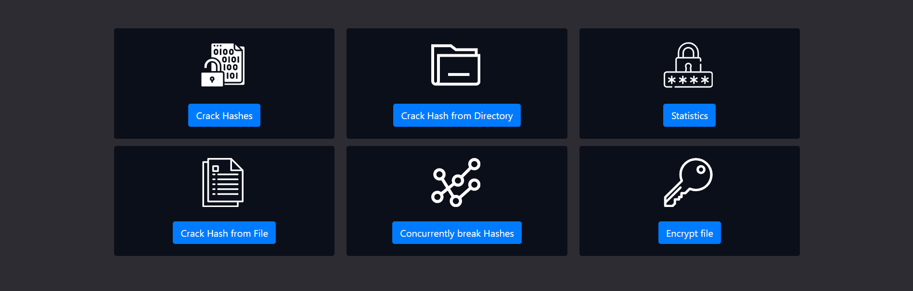

<div align="center">
  </img>

# `Cryptohaze`

 

</div>

Cryptohaze is a high performance, open source, network-enabled cross-platform GPU and OpenCL accelerated password auditing tools for security professionals. It enables Penetration Testing by providing the facility of cracking the hashes of passwords in an organisation's database.

**We propose to implement a similar tool with some chosen features of Cryptohaze and some other useful features described as follows:**

✅Identify & Crack Hash <br>
✅ Crack from File <br>
✅ Crack from Directory <br>
✅ Concurrently Crack Hashes <br>
✅ Crack using Default WordList <br>
✅ Crack using Custom WordList <br>
✅ Password Strength Checker <br>
✅ Encrypt from File <br>
✅ View & Download Logs <br>


**Optimisation Measures** <br>
We use a Cache for the hashes cracked frequently; so as to reduce the computation power required for cracking hashes each time

---

## Demo

### Home




### Identify and Crack Hash


### Crack From File

With default wordlist


With custom wordlist


### Crack From Directory


Download Results


### Crack Concurrently


### Statistics


### Password Strength Checker


### Encrypt From File


### View & Download Logs


---

## Getting Started

### Prerequisites

-   Flask Framework
-   SQLite database

### Setup

Setup project environment with virtualenv and pip.

```
$ virtualenv venv
$ venv/scripts/activate
$ pip install -r https://github.com/kjsomaiya/css-assignment-1-coding-cryptohaze/blob/master/requirements.txt


$ cd projectname/
```

### Database Setup

Create SQLite Database (Lightweight Database):

```
$ from app import db
$ db.create_all()
```

---

### Running the app

```
$ python app.py
```

## Contributors

-   1711058 [Gayatri Srinivasan](https://github.com/gayatri-01)
-   1711059 [Girish Thatte](https://github.com/girishgr8)
-   1711063 [Amisha Waghela](https://github.com/amisha-w)

---
